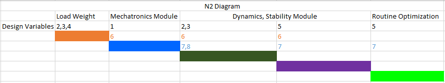
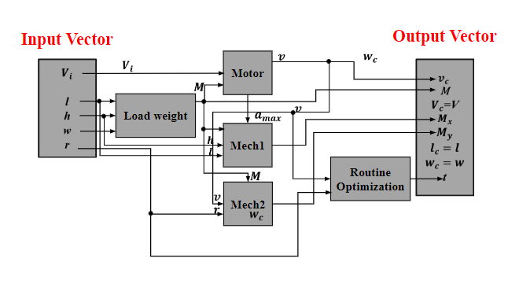

# Robot-Design-for-Warehouse-Logistics

## PROBLEM FORMULATION

### Objective
Maximize the mass and minimize the time of the products delivered by a warehouse drone by changing geometric parameters of the robot, voltage and turning radius while avoiding toppling of the products and avoiding obstacles in the environment with a fixed path that is to be followed. 
Fixed path description: In this analysis for the path, we have specified 3 points (starting, ending and an in-between checkpoint)
Assumptions: 
Density of load is fixed and assumed uniform throughout the volume for simplified calculations
DC Motor is fixed for the analysis.
Friction coefficient is assumed to be constant throughout the motion
Centre of mass of the system is assumed to be in the center of the geometry.

### Master Table
In this problem we have 5 design variables for taking into consideration the geometry of the drone, voltage supplied, geometry of the load and turning radius of the drone. In this problem there are two objectives, to maximize the mass of the products moved and to minimize the time to do it. To reduce the complexity of the problem, we have 8 parameters. In order to incorporate safety in our design, we have constraints on the moment along x and y-axis

### N2 Diagram
From the N^2Diagram we can note that there are multiple disciplines involved in this optimization like mechatronics, dynamics and routine optimization. The data of the dependent variables is exchanged between different modules making it a very interconnected problem between the disciplines involved.

### Block Diagram
Block diagram provides better understanding of the interconnectivity between the different modules. The weight of the load from the load weight module goes to Motor (Mechatronics module) so as to get velocity from the motor specifications. The weight of load also goes to Mech 1, 2 (Dynamics Module for X and Y direction) so as to ensure the safety (avoiding toppling) constraints are satisfied. The velocity goes to Mech 1, 2 modules as well as in the routine optimization module to set an upper bound on the turning radius.

## Design of experiments
A DOE was conducted to explore the design space for all the modules. The bounds based on the constraints were taken in Table 1 for each design variable. A full factorial was initially planned but many entries were removed due to computational costs and thus the focus was placed on doing partial factorial to get more information in lesser amount of time. DOE has 5 factors and 2 levels. These are some of the feasible starting points. DOE helped in the optimization process by giving a very good initial point for gradient base method. DOE had total 8 experiment. The trend showed that a small and compact drone had a higher efficiency to carry the load. 

## Algorithm selection
### Gradient based method
Because all the variables of the system are continuous, which means that they are differentiable. Gradient based method is the easiest way to solve the problem. The problem has two objective function. The first objective function is maximizing the mass M of the load. Use “fmincon” function in Matlab with SQP algorithm. After doing multi-start, Matlab gives the same result, so the solution is global maximum.

### Heuristics in multi-objective problem
Genetic algorithm (GA) can be used to verify if the result from gradient based method is global optima or not. It can also be used to search pareto front between two objective function. The left plot shows the pareto front between maximizing M and minimizing t. The right plot shows the pareto front between maximizing M and 1/t. Although the pareto front looks like linear in right plot, it is convex by checking KKT condition. 

## Multi-objective analysis
### New objective function
Apply new objective function based on the pareto plot, where the mass increases while 1/t decreases. To maximize both value, new objective function is M/t.

### Gradient based method on the new objective function
Use “fmincon” function in Matlab with SQP algorithm to optimize this single objective

### Genetic algorithm on the new objective function
Multi-start almost proves that the result given by gradient based method should be global optima. 

## Final Design Based on Tradeoff
The final design is based on the tradeoff between two objective function as new objective function. Input voltage is 48V. The drone has length of 0.82974m and width of "0.21853m" . The height of the load should be no more than "0.13542m" . The turning radius is 0.5m. With the design, the drone has ability to carry 19.644kg load, which is as nearly twice weight as itself. The total time of completing task is equal to 302.54s each round. The efficiency is 3.8958kg/min. 

## POST OPTIMALITY ANALYSIS
### Sensitivity analysis
The sensitivity analysis has been run on a previous found optimum. The optimum solution is that discussed in analysis part. The sensitivity has been tested for all the parameter like the density, Coefficient of friction, weight, height, wheel diameter. The discrete motor variable has been set constant for this analysis. Multi objective was combined into a single objective, efficiency (M/t) for the sensitivity calculations.

## CONCLUSION
Design of experiments gave a good starting point which played a pivotal in reaching global optimal faster. Fmincon found the global optimum simply as the functions were differentiable by using multi-start. Scaling helped in decreasing computational time drastically but did not change the global minima. Although, heuristics based optimization diverged in few cases, we confirmed with it the optima we got from the gradient based optimization. Through extensive testing with gradient-based and heuristic algorithms and exploration of design space we are very confident that we have found the global optima.

